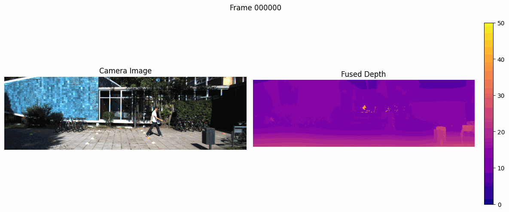

<div align="center">


<p>
  
  
  
  
  
</p>

<p>
  
  
  
  
</p>

[](https://colab.research.google.com/github/VasuTammisetti/KITTI_LiDAR_Camera_Fusion_For-Better_Deapth-map/blob/main/Camera_LiDAR_Fusion.ipynb)

<br>

> **Sparse LiDAR is accurate but full of gaps. Monocular depth is dense but scale-ambiguous.**
> **This project solves both problems simultaneously — no retraining, no stereo camera required.**

</div>

---

## 🎬 Live Demo

<div align="center">



*Six-panel benchmark: Camera → Sparse LiDAR → Dense LiDAR → Raw MiDaS → Scaled MiDaS → **Fused Depth***

https://github.com/VasuTammisetti/KITTI_LiDAR_Camera_Fusion_For-Better_Depth-map/raw/refs/heads/main/fusion_demo%20(1).mp4

</div>

---

## 📦 Dataset

[](https://zenodo.org/records/19111017)

**[⬇ Download Dataset — Zenodo](https://zenodo.org/records/19111017)**

The archive contains pre-organised `data_object_image_2`, `data_object_velodyne`, and `data_object_calib` folders ready to use directly with the notebook.

---

## 🧭 The Core Problem

| Sensor | Output | Problem |
|--------|--------|---------|
| 📡 **LiDAR alone** | Accurate metric depth | Extremely sparse — only ~5% of pixels covered |
| 📷 **Camera (MiDaS) alone** | Dense, edge-preserving depth | Scale-ambiguous — no absolute distance |
| 🔀 **This project** | **Dense + metrically accurate** | ✅ Best of both worlds |

> **LiDAR provides the scale. MiDaS provides the density.**
> A single median-scaling step aligns them — no training data, no neural fusion network required.

---

## 🏗️ Pipeline Architecture
```
┌──────────────────────────────────────────────────────────────────┐
│                        INPUT                                     │
│   📷 Camera Image (1242×375)    📡 LiDAR Point Cloud (~120K pts) │
└───────────────┬──────────────────────────────┬───────────────────┘
                │                              │
                ▼                              ▼
┌───────────────────────┐          ┌───────────────────────────┐
│   MiDaS DPT-Large     │          │   LiDAR Projection        │
│   Transformer         │          │                           │
│                       │          │  • P2 · R0 · Tr_velo      │
│  Dense depth map      │          │  • Sparse depth map       │
│  (scale-ambiguous)    │          │  • NN interpolation       │
│                       │          │    → Dense LiDAR depth    │
└──────────┬────────────┘          └─────────────┬─────────────┘
           │  D_mono (relative)                  │  D_lidar (metric)
           └─────────────────┬───────────────────┘
                             ▼
              ┌──────────────────────────┐
              │     SCALE ALIGNMENT      │
              │                          │
              │  scale = median(D_lidar) │
              │          ─────────────── │
              │          median(D_mono)  │
              │                          │
              │  D_scaled = D_mono × s   │
              └──────────────┬───────────┘
                             ▼
              ┌──────────────────────────┐
              │      LATE FUSION         │
              │                          │
              │  D_fused = (D_scaled     │
              │           + D_lidar) / 2 │
              └──────────────┬───────────┘
                             ▼
              ┌──────────────────────────┐
              │   DENSE METRIC DEPTH ✅  │
              └──────────────────────────┘
```

---

## 📐 Scale Alignment — The Core Code
```python
# 1. Get valid LiDAR pixels
valid_mask = sparse_lidar_depth > 0

# 2. Sample monocular depth at those same pixels
mono_at_lidar = midas_depth[valid_mask]
lidar_vals    = sparse_lidar_depth[valid_mask]

# 3. Compute scale factor — single scalar, zero training needed
scale = np.median(lidar_vals) / np.median(mono_at_lidar)

# 4. Apply to full monocular depth map
scaled_midas = midas_depth * scale

# 5. Fuse
fused_depth = (scaled_midas + dense_lidar) / 2.0
```

---

## 📊 Six-Panel Benchmark Results


| Panel | Description | Key Property |
|-------|-------------|--------------|
| **(a) Camera** | RGB reference image | Texture, colour, edges |
| **(b) Sparse LiDAR** | Raw projected points | Accurate but ~5% coverage |
| **(c) Dense LiDAR** | NN-interpolated | Complete but blurred edges |
| **(d) Raw MiDaS** | Transformer depth | Dense but no metric scale |
| **(e) Scaled MiDaS** | Median-aligned | Dense + metric scale ✅ |
| **(f) Fused Depth** | **(d) + (e) averaged** | **Dense + accurate + metric** ✅ |

> All depth maps rendered at the same colour scale (0–50 m) for direct visual comparison.


---

## 🆚 Comparison to Other Methods

| Method | Dense | Metric Scale | Single Camera | No Training | Edge Quality |
|--------|-------|-------------|---------------|-------------|--------------|
| LiDAR only | ❌ | ✅ | ✅ | ✅ | ⚠️ Sparse |
| Stereo depth | ✅ | ✅ | ❌ Two cameras | ✅ | ✅ Good |
| MiDaS only | ✅ | ❌ | ✅ | ✅ | ✅ Excellent |
| Supervised fusion | ✅ | ✅ | ✅ | ❌ Needs labels | ✅ Excellent |
| **This project** | ✅ | ✅ | ✅ | ✅ | ✅ **Excellent** |

---

## ✨ Feature Highlights

- **MiDaS DPT-Large** vision transformer — state-of-the-art zero-shot monocular depth
- **KITTI calibration matrices** (P2 · R0 · Tr_velo_to_cam) for precise LiDAR projection
- **Median scale alignment** — one scalar, zero labels, zero retraining
- **Nearest-neighbour interpolation** for sparse-to-dense LiDAR conversion
- **Six-panel benchmark PNG** per frame for easy visual comparison
- **GIF + MP4 export** ready for GitHub and portfolio use
- Works with **any calibrated camera + LiDAR setup** — not just KITTI

---

## 🚀 Applications

| Domain | Use Case |
|--------|----------|
| 🚗 Autonomous Driving | Obstacle detection, free-space estimation, path planning |
| 🤖 Robotics | Grasping, navigation, SLAM in unstructured environments |
| 🥽 AR / VR | Occlusion handling, realistic virtual object placement |
| 🏭 Industrial | Quality control, dimension measurement, inspection |
| 📹 Surveillance | People counting and 3D position tracking |

---

## ⚡ Quick Start

### 1. Open in Colab

[](https://colab.research.google.com/github/VasuTammisetti/KITTI_LiDAR_Camera_Fusion_For-Better_Deapth-map/blob/main/Camera_LiDAR_Fusion.ipynb)

### 2. Download Dataset

[](https://zenodo.org/records/19111017)

### 3. Organise Data
```
sensorfusion/
└── sensorfusion/
    ├── data_object_image_2/training/    ← .png files
    ├── data_object_velodyne/training/   ← .bin files
    └── data_object_calib/training/      ← .txt files
```

### 4. Run
```
Runtime → Run all   (Ctrl+F9)
```

---

## 🗺️ Roadmap

- [x] LiDAR projection + sparse depth map
- [x] MiDaS DPT-Large monocular estimation
- [x] Median scale alignment
- [x] Pixel-wise late fusion
- [x] Six-panel benchmark visualisation
- [x] GIF + MP4 export
- [ ] Learned fusion (CNN/attention-based)
- [ ] nuScenes dataset support
- [ ] ROS2 real-time node
- [ ] RMSE / AbsRel / δ<1.25 evaluation metrics

---

## 🎓 Academic Context

Developed as part of doctoral research in **meta-learning for ADAS perception** at the **University of Granada**, in collaboration with **Infineon Technologies AG**. This fusion methodology complements work on **Meta-YOLO** and **stereo depth estimation** — contributing toward a full sensor fusion stack (camera + LiDAR + radar) optimised for embedded ADAS NPUs.

---

## 🙏 Acknowledgements

| Resource | Link |
|----------|------|
| KITTI Vision Benchmark | [cvlibs.net/datasets/kitti](http://www.cvlibs.net/datasets/kitti/) |
| MiDaS — Intel ISL | [github.com/isl-org/MiDaS](https://github.com/isl-org/MiDaS) |
| DPT Paper | [Ranftl et al., ICCV 2021](https://arxiv.org/abs/2103.13413) |
| Zenodo Dataset | [10.5281/zenodo.19111017](https://zenodo.org/records/19111017) |
| Infineon Technologies AG | ADAS Research Collaboration |
| University of Granada | Doctoral Programme |

---

<div align="center">

**MiDaS** · **DPT-Large** · **LiDAR Fusion** · **Metric Depth** · **KITTI** · **ADAS**


*Built with ❤️ for autonomous driving research*

</div>
